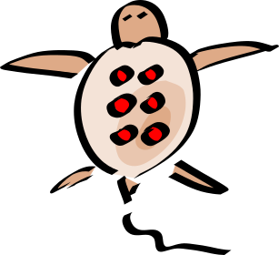
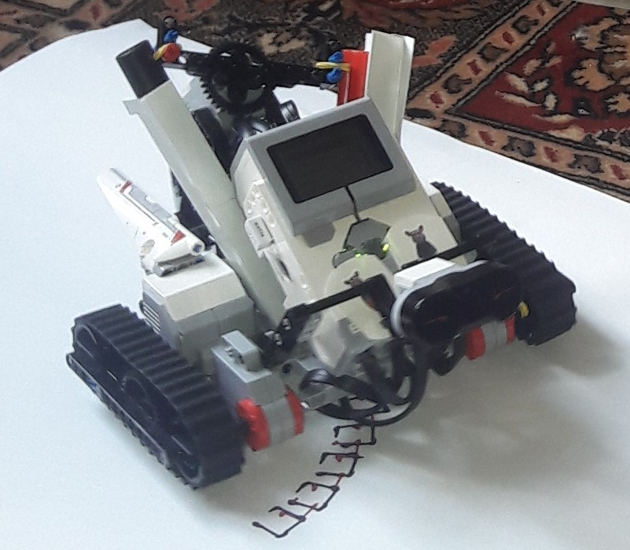
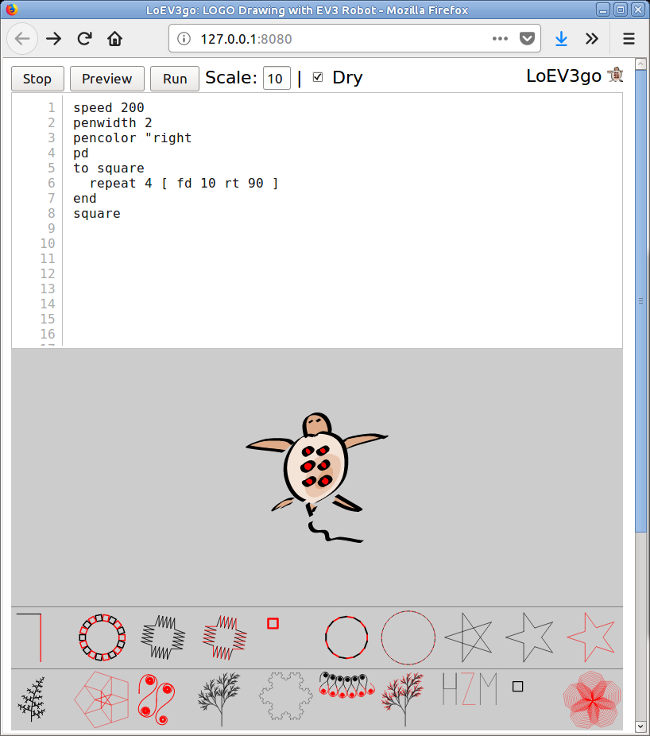

# LoEV3go: A LOGO language interpreter for LEGO EV3 robot
Ondřej Bojar, bojar@ufal.mff.cuni.cz

51 years after the [LOGO language](https://en.wikipedia.org/wiki/Logo_(programming_language))
was designed, a physical LOGO turtle finally arrives: **LoEV3go**!

LoEV3go is a LOGO interpreter is based on [pylogo](http://pylogo.sourceforge.net/) ported to python3. It runs on the [EV3 intelligent brick](https://shop.lego.com/en-US/EV3-Intelligent-Brick-45500)
under Linux, [EV3DEV](http://ev3dev.org/). On the outside, it looks as a:

- IR-controlled turtle (pacifists don't play with tanks, do they).
  - with two felt-tip pens (switchable with the beacon button)
- Web server for entering a LOGO program.
  - After a preview, the robot turtle will draw the LOGO program on the <s>carpet</s> canvas underneath.

Build your turtle (building instructions will hopefully come one day), run LoEV3go, open a web browser,
write your LOGO code and watch the turtle draw on the ground.

## Features



- Only 31313 EV3 Mindstorms Basic Set is needed (and an SD card for EV3).
- Two felt-tip pens supported, to choose from two colors as you go.
- IR controlled, if you want to "draw by hand".
- On-board web server to interpret, preview and execute your LOGO code.

## Wishlist

- Precision, precision, precision. Obviously, precision is troublesome. See the [square pearls](https://raw.github.com/obo/loev3go/master/screenshots/first-loev3go-run-results.jpg) that I had to run 3x in a row to reach the full circle (and the circle did not close anyway).
  I originally thought that mousometry (an optical mouse attached to LoEV3go providing more precise odometry) would help but a more plausible technique seems global positioning, see the [arucoloc subdirectory](https://github.com/obo/loev3go/tree/master/arucoloc).

- The robot could have a "security" feature: the LOGO program will stop immediately
when the color sensor does not see enough white or when the touch sensor hits
something. Obviously, you can still damage your floor if the turtle runs
backwards...

- The robot could first scan the carpet to determine the white area and scale the image accordingly.

## Usage

### Running without EV3 robot

The following code will run LoEV3go with "Fake3EV", a crippled ev3dev python bindings that don't try to really use any of the motors or sensors. Sensor data is meaningless and motor operations are just dummy sleep commands. LoEV3go can be however nicely debugged on a normal and fast computer.

```bash
  git clone ... # clone LoEV3go using the Clone link above
  cd loev3go
  ./loev3go.sh --fake3dev
```

### Using the web page

Here is a screenshot of the web page served by the robot:
<center>

</center>

#### Preview, Scale, Dry Run, Draw

To draw with LoEV3go, follow these steps:
1. Type your LOGO code into the text area.
2. Click **Preview** and wait for the robot to interpret the code. Remember, EV3 brick is slow...
3. Click **Run**. The robot will run the last previewed code.
  - With **Dry** run check box checked, all ```pendown``` commands will be ignored.
  - The **Scale** determines the scaling of forward and backward movements.
  - It is wise to run the code in dry run, modify scaling as needed, move the robot back to the starting position, dry run again etc. until you are happy with the space occupied.
  - Finally, uncheck **Dry** run box, click **Run** and watch.

#### Loading and saving

LoEV3go comes with 20 slots for saved LOGO code, see the thumbnails underneath the preview pane.

To load one of the saved programs, click the thumbnail. **You current code in the textarea will be replaced** without any undo option!

To save a LOGO program under one of the thumbnails:
1. Write the code in the text area.
2. **Preview** it.
3. **CTRL-click** the thumbnail. The last previewed code will be saved at that position.

#### Detailed settings

(todo)

## Bugs and TODO

- get rid of dependence on jquery, if robot not connected to Internet, nothing
  works

<hr/>
<font size="1">LEGO® is a trademark of the LEGO Group of companies which does not sponsor, authorize or endorse this project.</font> 
