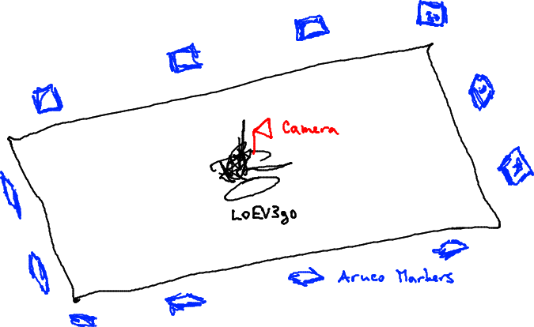

# Global Positioning using Aruco Markers

The plan is to equip LoEV3go with global positioning using Aruco markers placed
around the canvas on which LoEV3go is drawing, as sketched here:



LoEV3go would start by turning around, perhaps moving to two locations,
taking e.g. 12--20 pictures and creating the map with Marker Mapper. Then at
runtime, LoEV3go would regularly take a
picture, run Aruco tools to find its true location based on the markers it sees
at
the moment and apply any necessary small movements to hopefully move to the
real location given its assumed location.

## Steps Needed

- Webcam running on EV3 [done]
- Webcam calibrated
- Aruco and MarkerMapper compiled on EV3 [in process]
- MarkerMapper speed tested on EV3
- Using MarkerMapper to create the map. [done]
- Using Aruco to find camera position given a new picture [done]
- Physical layout of markers around the canvas, number of pictures needed for
  the map.
- LoEV3go integration
  - Consider storing more pictures and re-generating the map as more are collected, could be useful esp. in corners.

## Webcam Calibration

[OpenCV Interactive calibration](https://docs.opencv.org/3.4.1/d7/d21/tutorial_interactive_calibration.html)

...except I don't understand where the actual application is in opencv.

## Aruco and MarkerMapper

The best documentation of Aruco and MarkerMapper is here:
- https://docs.google.com/document/d/1QU9KoBtjSM2kF6ITOjQ76xqL7H0TEtXriJX5kwi9Kgc/edit#heading=h.sxfg1jh7nibb
- I downloaded it as PDF here: ``ArUco_Library_Documentation.pdf``

Download Aruco and MarkerMapper:
- https://sourceforge.net/projects/aruco/files/?source=navbar
- https://sourceforge.net/projects/markermapper/files/?source=navbar

Compile and install Aruco without root access:

```bash
cd aruco
mkdir build
cd build
mkdir -p $HOME/opt/
cmake -DCMAKE_INSTALL_PREFIX:PATH=$HOME/opt/aruco-3.0.11 ..
make
make install
```

**Minor fix needed in Aruco**: replace ``#endifxx`` with ``#endif`` in
``aruco-3.0.11/utils_calibration/dirreader.h``, line 1168.


Compile MarkerMapper:

```bash
cd markermapper
mkdir build
cd build
export aruco_DIR=/home/bojar/opt/aruco-3.0.11/
cmake ..
make
```

**Minor fix needed in MarkerMapper**: Replace:
```C
  auto p2=center+vp*markersize/2;
```
with
```C
  auto p2=center+markersize/2 * vp;
```
in ``marker_mapper1.0.12/utils/sglviewer.h``, line 68.

## Compiling Aruco and MarkerMapper on EV3

```bash
mkdir src
cd src
# now obtain aruco-3.0.11.zip and marker_mapper1.0.12.zip
unzip aruco-3.0.11.zip
unzip marker_mapper1.0.12.zip
# patch both packages for my needs
patch -p 0 < ../aruco-and-markermapper-compilation/aruco-3.0.11.patch
patch -p 0 < ../aruco-and-markermapper-compilation/marker_mapper1.0.12.patch
# compilation prerequisities:
sudo apt-get install cmake
# compile and install aruco to ~/opt/aruco-3.0.11
cd aruco-3.0.11
mkdir build
cd build
mkdir -p $HOME/opt/
cmake -DCMAKE_INSTALL_PREFIX:PATH=$HOME/opt/aruco-3.0.11 ..
make
make install
cd ..
# compile markermapper, don't even install it
cd marker_mapper1.0.12
mkdir build
cd build
export aruco_DIR=$HOME/opt/aruco-3.0.11/
cmake ..
make
```

The compilation is extremely challenging because EV3 is slow, has too small memory and also there is some system instability under such heavy load. So sometimes the same file compiles and sometimes it fails. I spent like 3x full batteries and I am at 11% of aruco compilation only.

Cross-compilation will be necessary, or serious source code reduction, e.g. seriously limit the built-in dictionaries.

Links for cross-compilation:
- https://www.ev3dev.org/docs/tutorials/using-docker-to-cross-compile/
- https://hub.docker.com/r/ev3dev/debian-jessie-cross/

## Creating Marker Map

Following [MarkerMapper Usage Instructions](http://www.uco.es/investiga/grupos/ava/node/57), I ran the following on the suggested [example dataset](https://sourceforge.net/projects/markermapper/files/test_data/).

```bash
marker_mapper1.0.12/build/utils/mapper_from_images \
  sample_markers_test sample_markers_test/cam.yml 0.123 ARUCO out
```

Args:
- ``sample_markers`` is the directory with images
- ``cam.yml`` is the camera calibration file.
- 0.123 is the physical size of the markers in whichever unit, here meters
- ``ARUCO`` is the dictionary of markers used
- ``out`` is the prefix for output files

A file called ``out.yml`` will be created, this is what we need and we will
call it ``marker_map.yml`` in the following.

The ``out.log`` reports camera locations for each used image in the format
described under [Ground Truth Trajectories](https://vision.in.tum.de/data/datasets/rgbd-dataset/file_formats).
I still need to figure out how to get the robot heading angle from the unit
quaternion notation but the location is straightforward.

One can hack the ``out.yml`` map and add fake markers to indicate the positions of the camera for each of the image.

## Using Aruco to Locate the Robot Given Marker Map

I simplified ``aruco/utils_markermap/aruco_test_markermap.cpp`` into ``aruco_locate_one.cpp`` for my needs.

```bash
../aruco_locate_one sample-with-markers.jpg marker_map.yml cam.yml -save sample-with-markers.annotated.jpg
```

This will emit the location of the camera and optionally the picture annotated
with the known markers found in it.

TODO: Consider adding ``-server`` mode in which it would listen to stdin and
for ever newline, read the camera picture again (from camera or a given
filename) to save some initialization time, if that time is significant.

## Camera Calibration

All the following is done in the subdirectory ``camera-calibration/``.

1. Print ``printed_pattern_chessboard.png`` on A4 sheet.
2. Run ``./calibrate-with-chessboard.py`` and show the sheet to the camera several times (10 by default).

When the calibration says "Calibrated", you will have a file ``calibration.yaml`` in the current directory.

Older description and boards to print:

https://docs.opencv.org/3.3.1/da/d13/tutorial_aruco_calibration.html

https://docs.opencv.org/3.1.0/df/d4a/tutorial_charuco_detection.html

https://longervision.github.io/2017/03/16/OpenCV/opencv-internal-calibration-chessboard/

https://longervision.github.io/2017/03/12/OpenCV/opencv-external-posture-estimation-ArUco-board/

## Issues with Aruco Dictionaries

I printed ``printed-board_aruco_57-markers-from-6x6_250.png`` without knowing from which dictionary it comes. It turned out to be ``cv2.aruco.DICT_6X6_250``.

When I test it with ``./test-aruco-search.py``, all images are found, with IDs 0-34.

When I test it with ``aruco_test live:1`` from the aruco C library, it finds
only sporadically only a few markers, with IDs: 11 162 211 239 92.

Clearly, there is a dictionary mismatch.

OK, I fixed this by emiting the dictionary from python2 aruco version, see ``emit-dictionary.py``, in to ``DICT_6x6_250.dict``.

I confirmed that the C aruco can now find all my markers printed in ``printed-board_aruco_57-markers-from-6x6_250.png``:

```bash
aruco-3.0.11/build/utils/aruco_test live:1 -d DICT_6x6_250.dict
```

## Marker Map Creation

Finally, with the custom dictionary, I was able to create my first marker map:

```bash
d=shots-DICT_6x6_250;
marker_mapper1.0.12/build/utils/mapper_from_images \
  shots-DICT_6x6_250 \
  shots-DICT_6x6_250/calibration.yaml \
  0.04 DICT_6x6_250.dict \
  shots-DICT_6x6_250.map
```

The files related to the map are also pushed to the repo here.

## Marker Map Use

With the custom dictionary, custom map and my ``aruco_locate_one``, I finally got the estimated camera position:

```bash
aruco-3.0.11/build/utils_markermap/aruco_locate_one \
  shots-DICT_6x6_250/shot-01.jpg \
  shots-DICT_6x6_250.map.yml \
  shots-DICT_6x6_250/calibration.yaml
```

...emited this output:

```
Camera position as getRvec, getTvec: [2.174823, 2.0144002, -0.48945314] [0.20740934, -0.11405521, 0.84579444]
Camera position as TUM RGBD: 0 0.372795 -0.115674 0.78679 0.722148 0.66888 -0.162522 -0.0684754
```

Note that the ``map.yml`` contains the name of the custom dictionary, so I had to make the file visible under another name, too: ``ln -s DICT_6x6_250.dict aruco.DICT_6X6_250``. In 20-manual-mapping/collect-pictures-and-create-map.py, I am modifying the generated map file to point to the correct dictionary file.

## Interpreting Output of ``aruco_locate_one``

getRvec and getTvec are: XXX todo

TUM RGBD is described here: https://vision.in.tum.de/data/datasets/rgbd-dataset/file_formats


This code https://github.com/aliyasineser/GraduationProjectII/blob/master/RelativePositionTest.py and the corresponding post http://answers.opencv.org/question/191153/aruco-relative-marker-position-and-rvectvec-inversion/ seem to show it.


...now implemented in 20-manual-mapping/collect-pictures-and-create-map.py
Usage:
- scan space, marker_mapper will be run 3x, possibly use ESC to close it
- place camera to home
- press space to save home position
- observe the numbers as they report the position relative to home
  - the numbers should be yaw, pitch and roll, followed by translation


## Thoughts on LoEV3go Global Positioning

- LoEV3go has to be aware of its assumed global position
  - Every LOGO command has to update the assumed position and heading.
- Take a picture only every once a while, e.g. between two LOGO commands after
  5 seconds or 3 rotation commands, whichever comes first.
- Store the assumed global position and heading when the picture was taken.
- Run subsequent LOGO commands while processing the picture, record the
  (assumed) displacement in position and heading since the picture was taken.
- Once location is calculated from the camera, compare it with the stored
  assumed global position and heading. Record the necessary adjustment.
- Modify the adjustment as if the adjustment was calculated after the
  additional LOGO commands we ran in the meantime.
- Fiddle with the next ``forward`` or ``backward`` command, surrounding it with
  rotations before and after to carry out the adjustment -- to go to a slightly
  different position, which should be the globally correct one, and to have a
  slightly different heading afterwards, which should be the globally correct
  one.
- Use smaller and larger markers, to work from close and far away.

## Other Relevant Links

- https://github.com/goodrobots/vision_landing
